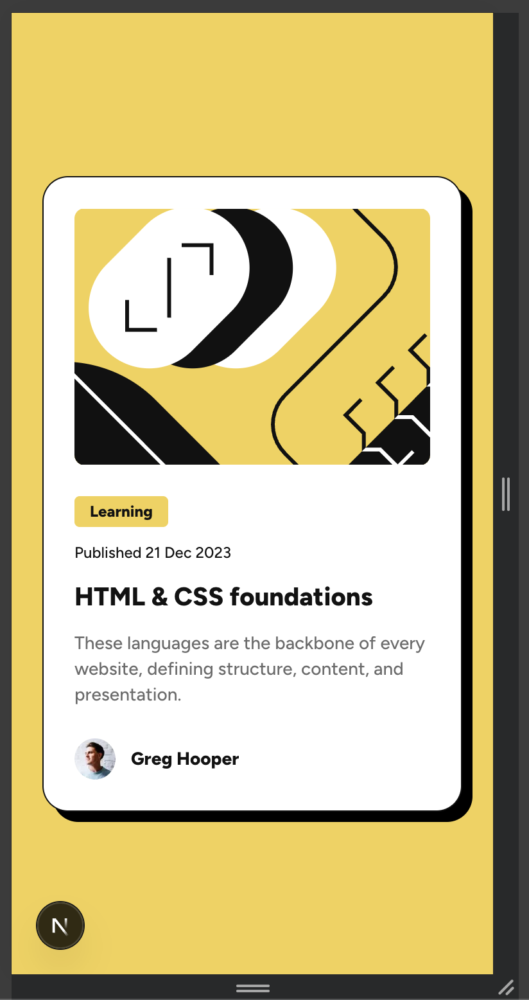

# Frontend Mentor - Blog preview card solution

This is a solution to the [Blog preview card challenge on Frontend Mentor](https://www.frontendmentor.io/challenges/blog-preview-card-ckPaj01IcS). Frontend Mentor challenges help you improve your coding skills by building realistic projects.

## Table of contents

- [Frontend Mentor - Blog preview card solution](#frontend-mentor---blog-preview-card-solution)
  - [Table of contents](#table-of-contents)
  - [Overview](#overview)
    - [The challenge](#the-challenge)
    - [Screenshots](#screenshots)
    - [Links](#links)
  - [My process](#my-process)
    - [Built with](#built-with)

## Overview

### The challenge

Users should be able to:

- See hover and focus states for all interactive elements on the page

### Screenshots

### Links

- Github Repository: [Github Repository](https://github.com/JasonY199/qr-code-component)
- Live Site URL: [Live site URL](https://blog-preview-card.jasony.dev/)

## My process

### Built with

- [Next.js](https://nextjs.org/) - React framework
- Tailwind CSS v4
- Tailwind custom properties
- Flexbox
- Mobile-first workflow
